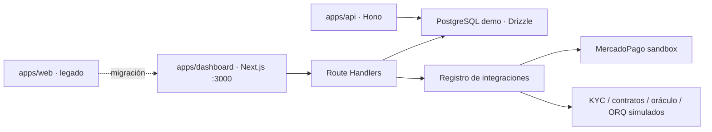

# Arquitectura actual reconstruida

## Sistema canónico

`apps/dashboard` es la única aplicación iniciada por `pnpm dev` y construida por `pnpm build`. La base de datos y las integraciones se inicializan de forma diferida, por lo que compilar o importar módulos no abre conexiones externas accidentalmente.

## Flujos conectados

1. **Génesis:** la API resuelve la identidad demo en el servidor, valida KYC y saldo, descuenta USD, acredita PACHA y crea orden, compra, auditoría, evento y ledger dentro de una transacción.
2. **P2P:** el servidor resuelve comprador/vendedor; una orden reserva tokens de forma atómica. La compra reclama la orden una sola vez, mueve USD/PACHA, crea el trade y encadena ambos movimientos de ledger.
3. **Landbank:** lanzamiento, préstamo, renta, voto y rendimiento perpetuo validan PNC/identidad demo. Préstamos y rentas producen transacciones, auditoría y evidencia; `YIELD_PERPETUAL_ATTEST` ya no se genera en el navegador.
4. **MercadoPago:** firma y forma del payload se validan antes de consultar PostgreSQL. Una referencia de pago es única y la acreditación es transaccional e idempotente.
5. **Ledger:** el panel consulta los movimientos persistidos del holder y muestra balances, referencias y hashes; dejó de ser un placeholder vacío.

## Identidades y datos

Las identidades se centralizan en `packages/database/src/demo/identities.ts`. El seed usa correos y UUID estables después de un reset, cinco propiedades PNC reconocibles por `metadata.code` y un libro P2P utilizable desde el primer arranque.

El reset elimina todas las tablas funcionales en orden de dependencias, pero solo después de que `validateDemoDatabaseUrl` confirme `DEMO_MODE=true` y una URL local/demo. En producción, los endpoints HTTP de reset/seed exigen además `DEMO_ADMIN_TOKEN`.

## Autorización

- `/dashboard/admin` y el dashboard raíz: `admin`, `operator`.
- `/dashboard/investor`: `investor`, `admin`, `operator`.
- `/dashboard/fideicomiso`: `fiduciario`, `comite`, `admin`, `operator`.
- `/demo`: cualquier rol autenticado; `DEMO_MODE=true` activa el bypass explícito del sandbox.
- `apps/api`: falla con 503 si no existe `SUPABASE_SERVICE_ROLE_KEY`; nunca permite acceso anónimo por una configuración incompleta.

Los Route Handlers críticos vuelven a validar el modo/entorno y no dependen únicamente del middleware.

## Estado de integraciones

| Capacidad | Estado local | Evidencia |
|---|---|---|
| PostgreSQL/Drizzle | Operativa cuando Docker está activo | tablas, balances, trades, auditoría |
| MercadoPago | Sandbox opcional | firma HMAC, payment ID, evento y tx hash |
| Ledger PACHA | Persistido/simulado | cadena SHA-256 en PostgreSQL |
| Contratos EVM | Pendiente de toolchain/deploy | fuentes Solidity presentes; Forge no instalado |
| KYC/oráculo/email | Simulado o pendiente | registro de integración |
| ORQ | Puente demo, no proceso core | `YIELD_PERPETUAL_ATTEST` persistido y marcado simulado |

## Límites que siguen abiertos

- No hay liquidación mainnet ni custodia real; los rendimientos son datos de referencia del demo, no promesas financieras.
- El modelo de préstamo registra posición y LTV de referencia, pero aún no inmoviliza lotes de colateral por propiedad.
- Falta reconciliar las migraciones SQL históricas con el esquema Drizzle; por ahora el entorno canónico usa `drizzle-kit push`.
- `apps/web` debe retirarse o migrarse por módulos una vez comparada toda funcionalidad restante.
- El dashboard canónico pasa ESLint sin errores ni advertencias. `apps/web`, mantenido solo como legado de migración, no tiene errores pero conserva 35 advertencias mecánicas de imports/variables sin uso.
- Los contratos requieren Foundry y pruebas/deploy coherentes antes de cambiar su estado de pendiente.
