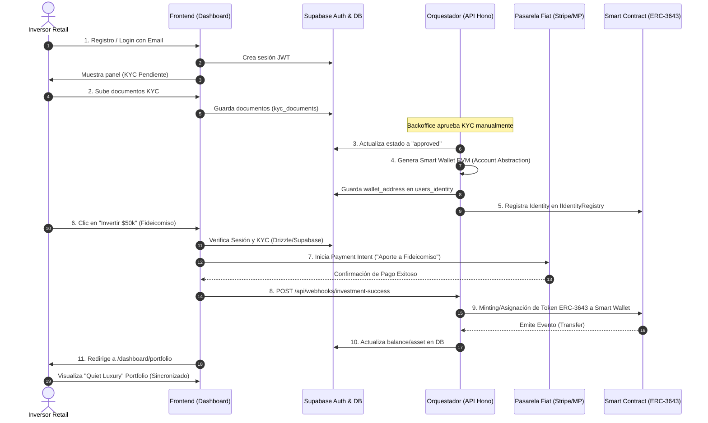

# Flujograma del Cliente (Fricción Cero RWA)

Este diagrama detalla el viaje de un inversor retail en PachaNova V2.0, desde el registro hasta la visualización de su portafolio, abstrayendo toda la complejidad de la blockchain.

### Explicación del Flujo "Fricción Cero":
1. **El cliente nunca toca Metamask ni guarda Seed Phrases.** La "Smart Wallet" se genera en el paso 4 en el background.
2. **El cliente paga con tarjeta o transferencia bancaria local.** El paso 7 usa Stripe/MercadoPago, pasando el compliance bancario bajo el concepto legal de "Aporte a Fideicomiso".
3. **Sincronización Web2-Web3.** El Orquestador Hono (Paso 8 y 9) firma las transacciones on-chain con su llave privada administradora, asignando los derechos reales al usuario de forma invisible.
